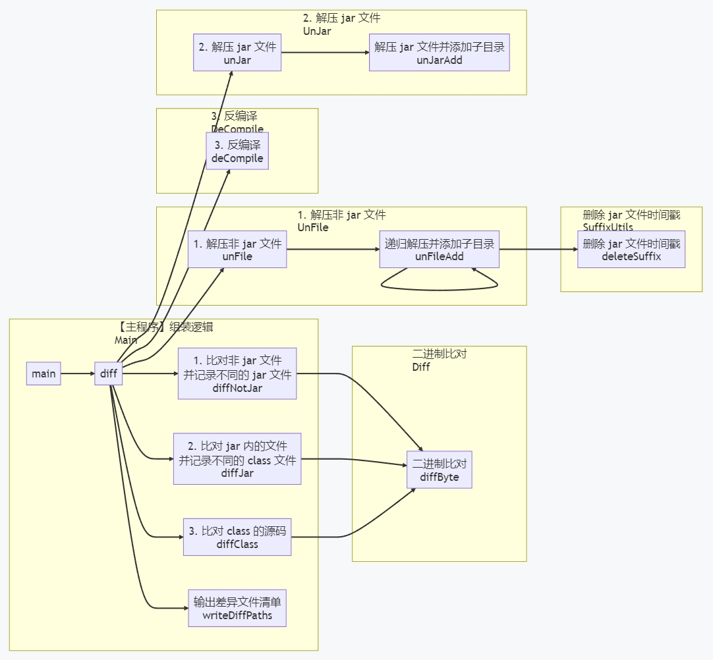

# compare-jar

[](https://plugins.jetbrains.com/plugin/22356-compare-jar)
[](https://plugins.jetbrains.com/plugin/22356-compare-jar)

### English Note
- Note：
  - use `javap -c` decompile class and delete same, auto decompress.
- Use：
  - Select two files and right-click<kbd>UnJar And Delete Same</kbd>
- build：
  - Maven package for Jenkins etc.
  - Gradle build for IDEA plugin.

### 中文说明

- 背景
  - 动态编译后的`toString()`方法行号差异导致 DO 的 class 文件不同，比对困难。
  - 所以写了这个工具利用`javap -c`反编译不带行号把相同的 class 文件删掉来帮助版本比对。
  - Windows 运行非常慢，建议在服务器中用 Jenkins 运行，详见 [本项目 GitHub 主页][Compare Jar GitHub]。
- 构建
  - Maven 打包成工具用于 Jenkins 等
  - Gradle 构建用于 IDEA 插件

#### Jenkins 使用方式指南

- 可以`mvn package`生成或在这里下载 zip：https://github.com/LinWanCen/compare-jar/releases
- 然后在服务器上执行以下命令创建目录上传解压
  ```shell script
  mkidr /var/lib/jenkins/workspace/compare
  cd /var/lib/jenkins/workspace/compare
  rz
  unzip compare.zip
  ```
- 登陆 Jenkins
- 点击 新建Item
- 创建自由风格（Freestyle project）的项目
- 描述
  1. 点击 Build with Parameters
  2. 选择文件后点击"开始构建"，等左下角上传进度完成
  3. 执行完毕后点击"工作区"或"工作空间"
  4. 点击打包下载全部文件
  5. 解压后用 IDEA 打开
  6. 选择两个文件夹，右键比较即可
  - [x] Discard old builds
    - 保持构建的最大个数 5
  - [x] This project is parameterized
    - File Parameter
      - file1
      - file2
- 构建环境
  - [x] Delete workspace before build starts
- 构建
  - Execute shell
    ```shell script
    mv file1 "1-$file1"
    mv file2 "2-$file2"
    java -jar /var/lib/jenkins/workspace/compare/compare.jar "1-$file1" "2-$file2"
    ```

## Plugin description 插件介绍

<!-- Plugin description -->

Delete same, use `javap -c` decompile class, auto UnTar, UnJar, UnZip.

对比投产包用，删除相同文件，反编译 class 对比，逐层解压，用于动态编译增加的方法行号不一致的场景。
<br>

# English

## How to Use

Select two files and right-click<kbd>UnJar And Delete Same</kbd>

## My Plugin
- Show doc comment at the Project view Tree, line End, json etc.: [Show Comment]
- Method call usage graph and maven dependency graph: [Draw Graph]
- Find author/comment of multiple files or lines and export Find: [Find Author]
- Auto sync coverage and capture coverage during debug: [Sync Coverage]
- Delete same, use `javap -c` decompile class, auto UnTar, UnJar, UnZip: [Compare Jar]

---

# 中文

## 用法

选择两个文件右键点击<kbd>逐层解压并删除相同文件</kbd>

Windows 运行非常慢，建议在服务器中用 Jenkins 运行，详见 [本项目 GitHub 主页][Compare Jar GitHub]。

## 我的项目
- 在文件树、行末、JSON 显示注释：[Show Comment]
- 生成 方法调用图 和 Maven 依赖图：[Draw Graph]
- 查找多个文件或行的作者 与 导出搜索：[Find Author]
- 自动同步覆盖率 和 调试中抓取覆盖率：[Sync Coverage]
- 删除相同文件，反编译 class 对比，逐层解压：[Compare Jar]

---

# 支持

如果对你有所帮助，别忘了给 [本项目 GitHub 主页][Compare Jar GitHub] 一个 Star，您的支持是项目前进的动力。

[Show Comment]: https://plugins.jetbrains.com/plugin/18553-show-comment
[Draw Graph]: https://plugins.jetbrains.com/plugin/draw-graph
[Find Author]: https://plugins.jetbrains.com/plugin/20557-find-author
[Sync Coverage]: https://plugins.jetbrains.com/plugin/20780-sync-coverage
[Compare Jar]: https://plugins.jetbrains.com/plugin/22356-compare-jar
[Compare Jar GitHub]: https://github.com/LinWanCen/compare-jar

<!-- Plugin description end -->

## Installation

- Using IDE built-in plugin system:
  
  <kbd>Settings/Preferences</kbd> > <kbd>Plugins</kbd> > <kbd>Marketplace</kbd> > <kbd>Search for "compare-jar"</kbd> >
  <kbd>Install Plugin</kbd>
  
- Manually:

  Download the [latest release](https://github.com/LinWanCen/compare-jar/releases/latest) and install it manually using
  <kbd>Settings/Preferences</kbd> > <kbd>Plugins</kbd> > <kbd>⚙️</kbd> > <kbd>Install plugin from disk...</kbd>

[Changelog 更新说明](CHANGELOG.md)

---
Plugin based on the [IntelliJ Platform Plugin Template][template].

[template]: https://github.com/JetBrains/intellij-platform-plugin-template
[docs:plugin-description]: https://plugins.jetbrains.com/docs/intellij/plugin-user-experience.html#plugin-description-and-presentation


本项目主要代码调用关系图，用我的 [Draw Graph] 插件生成：


